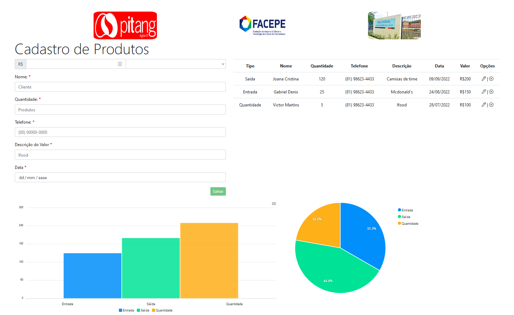

# Atividade Cadastro de Produtos
Utilizando uma aplicação dashboard angular em bootstrap, foi criado alguns campos extras como: __NOME__, __QUANTIDADE__ e __TELEFONE__, onde exportamos esses dados para a tabela ao lado e gerando dois gráficos, um gráfico em barra e outro em pizza trazendo __ENTRADA__, __SAÍDA__ e __QUANTIDADE__ de produdos, e por fim coloquei alguns logos da empresa __Pitang__, __FACEPE__(_Fundação de Amparo a Ciência e Tecnologia de PE_) e da instituição de ensino __ETE José Joaquim da Silva Filho__.

## Inicializando o projeto
Você deve instalar todas as dependências usando `npm i`.

E iniciar a aplicação do servidor usando `ng serve`.