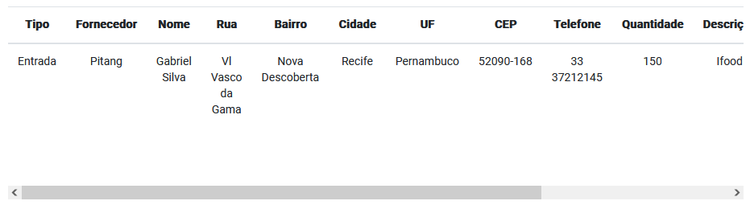
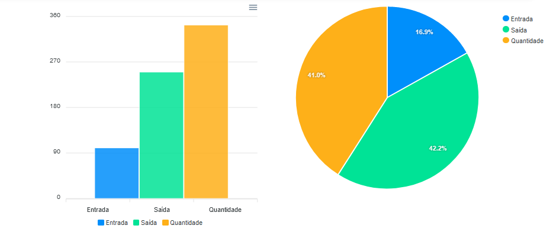

# Atividade Cadastro de Produtos #
Utilizando uma aplicação dashboard angular em bootstrap, foi criado alguns campos extras como: __NOME__, __QUANTIDADE__ e __TELEFONE__, onde exportamos esses dados para a tabela ao lado e gerando dois gráficos, um gráfico em barra e outro em pizza utilizando a __Lib__(_biblioteca_) [_ChartsJs_](https://www.chartjs.org/) trazendo __ENTRADA__, __SAÍDA__ e __QUANTIDADE__ de produdos, coloquei alguns logos da empresa [__Pitang__](https://www.pitang.com/), [__FACEPE__](https://agil.facepe.br/)(_Fundação de Amparo a Ciência e Tecnologia de PE_) e da instituição de ensino [__ETE José Joaquim da Silva Filho__](https://www.educamaisbrasil.com.br/escolas/escola-tecnica-estadual-jose-joaquim-da-silva-filho). Criei mais uma tabela para gerar __RUA__, __BAIRRO__, __CIDADE__, __UF__, __CEP__ e mais um ```Form-control``` para os __FORNECEDORES__. Tudo isso sendo salvo no método ```salvarValor()``` no ```file```(_arquivo_) ```home.component.ts``` e armazenado no [_LocalStorage_](https://medium.com/jaguaribetech/dlskaddaldkslkdlskdlk-333dae8ef9b8), utilizando a diretiva [_*ngFor_](https://warcontent.com/angular-ngfor/) para cada index de carteiras, trazemos os valores dos inputs para dentro da ```table```(_tabela_) assim como no código abaixo:
```
<tr *ngFor="let index of carteiras">
    <td>{{index.caixa}}</td>
    <td>{{index.fornecedores}}</td>
    <td>{{index.nome}}</td>
    <td>{{index.rua}}</td>
    <td>{{index.bairro}}</td>
    <td>{{index.cidade}}</td>
    <td>{{index.uf}}</td>
    <td>{{index.cep}}</td>
    <td>{{index.telefone}}</td>
    <td>{{index.quantidade}}</td>
    <td>{{index.descricao}}</td>
    <td>{{index.data_valor | date: 'dd/MM/yyyy'}}</td>
    <td>R${{index.valor}}</td>
    <td><i class="bi bi-pen text-primary" (click)="editarRegistro(index.id)"> </i> | <i
    class="bi bi-x-circle text-danger" (click)="deletaRegistro(index)"></i></td>
</tr>
```


Após os dados serem gerados na tabela, automaticamente através dos [_observables_](https://angular.io/guide/observables) conseguimos os dados do ```form-control``` sendo gerados nos gráficos na __folder__(_pasta_) ```npx-chart```.


## Inicializando o projeto ##
Você deve instalar todas as dependências usando `npm i`.

E iniciar a aplicação do servidor usando `ng serve`.

LINK PARA O DEPLOY DO PROJETO → [AQUI](https://cadastro-de-vendas.vercel.app/) ←